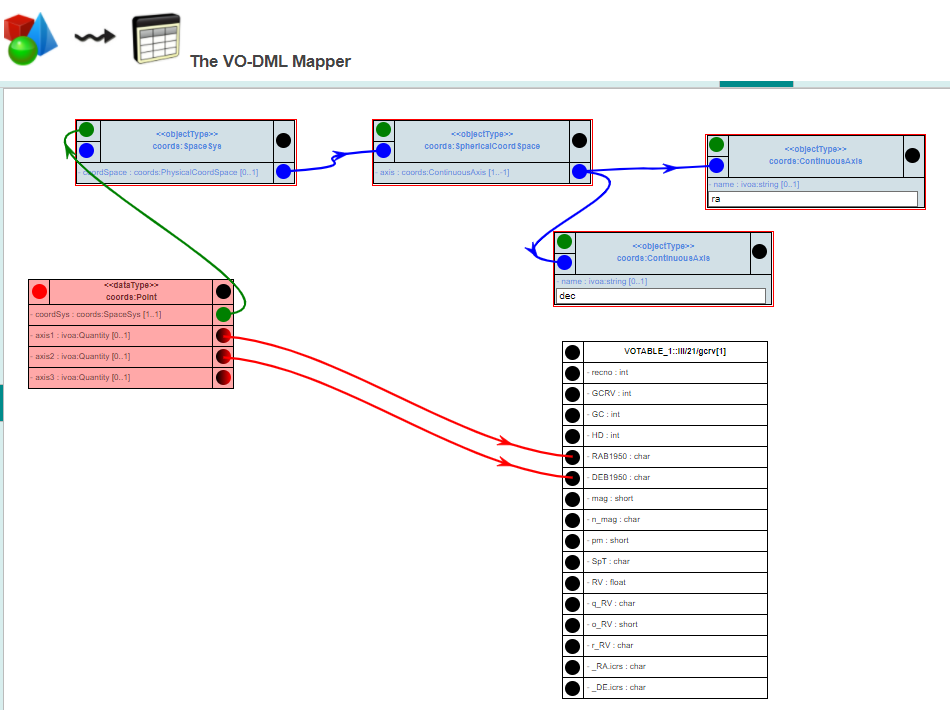
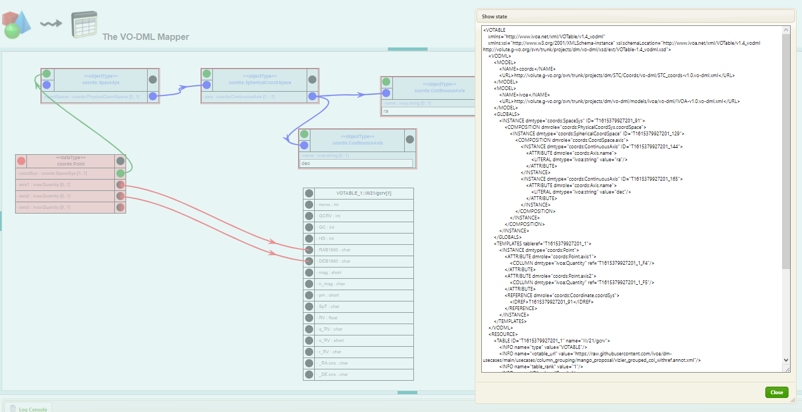

# `Column Grouping` Case

- The data table must be annotated in a way that a client can easily detect column groups.
- These groups have no particular semantic. They are just telling that the measures are related each to other.

(Vizier requirement)

## implementation using VODML-Mapper
See http://dsa012.pha.jhu.edu:8081/VODML-Mapper/
Right-click on canvas, choose "Browse Other Mappings".
On dialog click "submit". 
Find mapping named "MAPPING usecases column_grouping" and click green doanload button.

The mapping shown is similar to this image:

</img>

Right click the canvas and select "Show Mapping as VOTable" which will produce something like the following:

</img>

The result is copied in the votable in vizier_grouped_col_vodml-mapper.xml.
Note, the VODML-Mapper generates VOTables without DATA and other non-metadata elements.

 