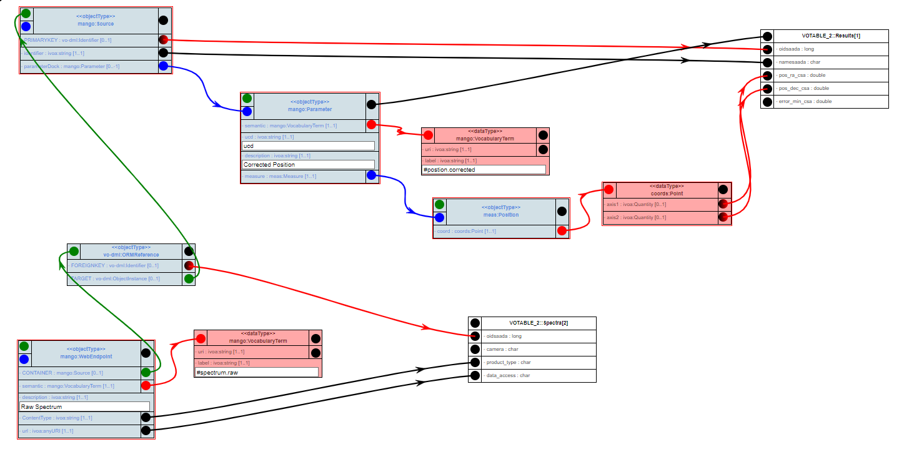

# `Combined Data` Case

Following a crossmatch (or just within a single table), tool authors want to
aggregate various pieces of information into new data points or products.
Examples include:

- Colours or even SEDs from photometry points
- Proper motions or even orbits from positional measurements
- Time series from, say, radial velocity measurements

(Source DM + MANGO) 

## implementation using VODML-Mapper
See http://dsa012.pha.jhu.edu:8081/VODML-Mapper/
Right-click on canvas, choose "Browse Other Mappings".
On dialog click "submit". 
Find mapping named "MAPPING usecases combined_data" and click green doanload button.

The mapping shown is similar to this image:

</img>

 