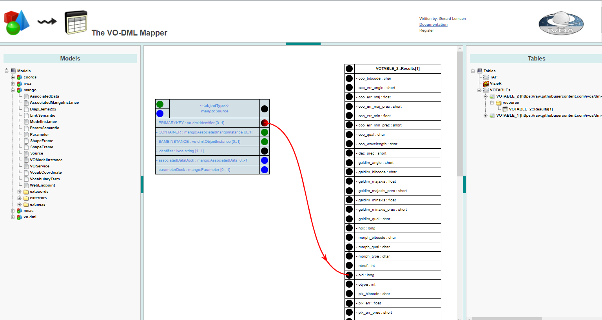

# Raw Data for the `Identity` Case

### `simbad_idonly.xml`

This table result from a simple TAP quersy on the `basic` Simbad table. Object aer identied by the `oid` field.

## implementation using VODML-Mapper
See http://dsa012.pha.jhu.edu:8081/VODML-Mapper/
Right-click on canvas, choose "Browse Other Mappings".
On dialog click "submit". 
Find mapping named "MAPPING usecases identity" and click green download button.

The mapping shown is similar to this image:

</img>

Notes:
* VO-DML itself does not explicitly define identifiers, but it is assumed all ObjectType-s have an identity. 
  How that is represented is left up to serializations. Hence in the VODML-Mappereach ObjectTYpe has an explicit PRIMARYKEY attribute, of type vo-dml:Identifier.
  'vo-dml' is a special model created for supporting these kind of serialization and mapping related features.
  It is a convenience model only used by the VODML-Mapper to avoid hardcoding such elements.
  These features map to features in the VOTable schema.
 