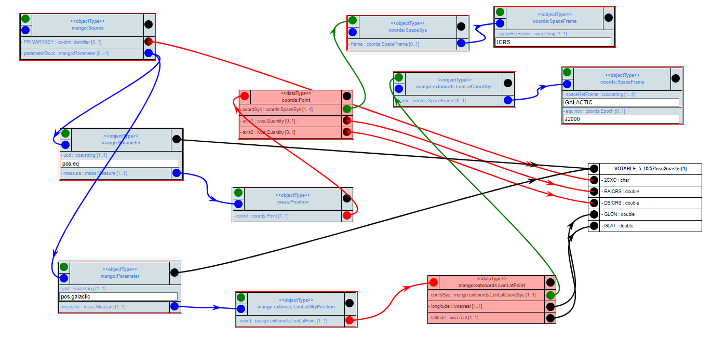

# `Native Frames` Use Case

Catalog annotators want to give coordinates in their catalogue’s native
frames and for whatever epoch is convenient for them in order to achieve
maximum precision, avoid hard-to-control error propagation in transformation
requiring additional information, and keep provenance simple. This becomes
more important as we have more and more data noticeably distant
from the J2000 epoch most of today’s major surveys are close to, and more
and more data precise enough that for a large number of objects proper their
motions since J2000 become relevant for daily work. (SourceDM WD)

## implementation using VODML-Mapper
See http://dsa012.pha.jhu.edu:8081/VODML-Mapper/
Right-click on canvas, choose "Browse Other Mappings".
On dialog click "submit". 
Find mapping named "MAPPING usecases native_frames" and click green download button.

The mapping shown is similar to this image:

</img>

