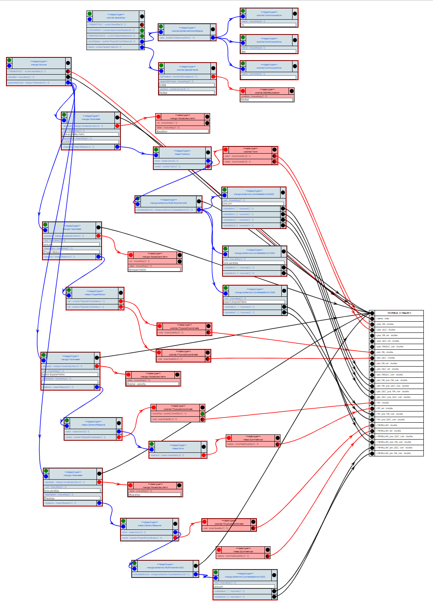

# Raw Data for the `Correlated Errors` Case

## `proto-covariance.xml`

- This is a mock VOTable. 
- It has been inspired from the use case of high accuracy astrometric data set e.g. Gaia.
- Both data and meta-data have been named and set in a way that facilitates the client code testing.

 - The data table contains the following quantities:
   - A position (2D vector)
   - A proper motion (2D vector)
   - A radial velocity (1D)
   - A parallax (1D)
 
-  All quantities have their proper error
   - Scalar error for the 1D values
   - 2D error + correlation for the 2D values
   
- Errors on different quantities can be correlated
   - Position and proper motion errors are correlated (4 values)
   - Position and radial velocity errors are correlated (2 values)
   - Position and parallax errors are correlated (2 values)
   - Proper motion and parallax errors are correlated (2 values)
 
 
 ## implementation using VODML-Mapper
See http://dsa012.pha.jhu.edu:8081/VODML-Mapper/
Right-click on canvas, choose "Browse Other Mappings".
On dialog click "submit". 
Find mapping named "MAPPING usecases precise_astrometry" and click green download button.

The mapping shown is similar to this image:

</img>
Note that many of the elements have been collapsed, which leaves only those roles engaged in some mapping in the image.
