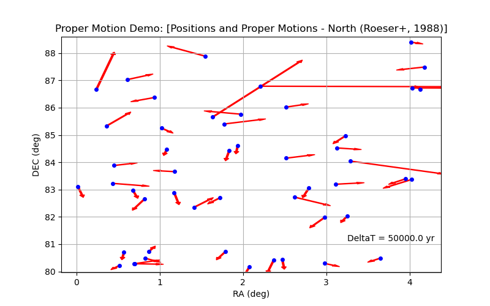
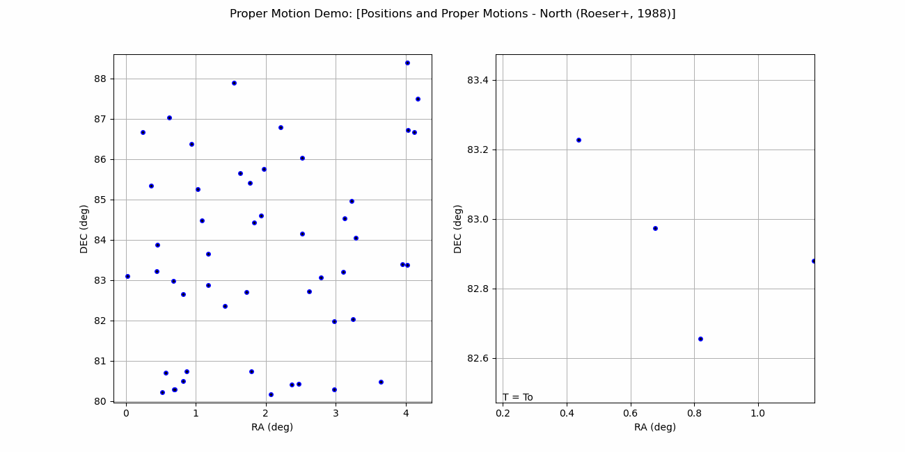

## Model Instance Summary:
Input file: vizier_propermotion_annotated.vot

### Goal: Load Data
    doc = Reader( Votable(infile) )
    positions  = doc.find_instances(Position)
    motions    = doc.find_instances(ProperMotion)

### Goal: High Level content summary
Number of Records: 50  
  o Position - type = rama.models.measurements.Position  
  o ProperMotion - type = rama.models.measurements.ProperMotion  

Position Coordinate auto-converted to AstroPy SkyCoord.
  o Position.coord - type = astropy.coordinates.sky_coordinate.SkyCoord  
  o Position.coord - frame = ICRS  
  o Position.coord - equinox = None  
  o Position.coord - unit = deg  

Proper Motion.
  o ProperMotion.lon - type = rama.models.coordinates.PhysicalCoordinate  
  o ProperMotion.lon.cval - type = astropy.units.quantity.Quantity  
  o ProperMotion.lon.cval.unit = arcsec / yr  
  o ProperMotion.lat - type = rama.models.coordinates.PhysicalCoordinate  
  o ProperMotion.lat.cval - type = astropy.units.quantity.Quantity  
  o ProperMotion.lat.cval.unit = arcsec / yr  

### Goal: Example content detail
```
print( measure_toString(positions.unroll()[0])) )
print( measure_toString(motions.unroll()[0])) )
```
Position: (   0.019192 [deg],  83.105303 [deg] ) ellipse(major:1.100e+01, minor:1.200e+01, angle:   nan) [ICRS]
Proper Motion: (   0.003600 [arcsec / yr],  -0.022000 [arcsec / yr] ) ellipse(major:4.900e+00, minor:5.400e+00, angle:   nan) [ICRS]
  

## Plot - Postion with ProperMotions
The Positions are already in AstroPy SkyCoords, we perform AstroPy Quantity math to determine x and y offsets due to proper motion.
```
    doc = Reader( Votable(infile) )
    pos = doc.find_instances(Position)[0]
    pm  = doc.find_instances(ProperMotion)[0]
    
    # Setup plot
    fig = plt.figure(figsize=[8.0,5.0])
    ax = fig.add_subplot(111)
    ax.grid(True)
    ax.set_title("Proper Motion Demo: [Positions and Proper Motions - North (Roeser+, 1988)]")
    ax.set_xlabel("RA ({})".format(pos.coord.ra.unit))
    ax.set_ylabel("DEC ({})".format(pos.coord.dec.unit))
    ax.set_xlim( np.min(pos.coord.ra.value)-0.2, np.max(pos.coord.ra.value)+0.2 )
    ax.set_ylim( np.min(pos.coord.dec.value)-0.2, np.max(pos.coord.dec.value)+0.2 )
    
    # Gather data and plot
    xvals = pos.coord.ra.value
    yvals = pos.coord.dec.value

    # Determine offsets due to proper motion
    deltaT = (50000.0 * u.Unit('yr'))
    dx     = (pm.lon.cval * deltaT).to(u.deg).value
    dy     = (pm.lat.cval * deltaT).to(u.deg).value

    # Plot Postions with Arrow indicating proper motion direction and speed
    ax.plot( xvals, yvals, markersize=4, marker="o", linestyle='', color="blue" )
    ax.text( 3.25, 81.1, "DeltaT = {}".format( deltaT ))
    for n in range(len(xvals)):
        ax.arrow( xvals[n], yvals[n], dx[n], dy[n], width=0.02, color="red" )

    plt.show()
    
```


## Animation - Postion with ProperMotions
For this animation, we combined the ProperMotion information into the AstroPy SkyCoord.
We then use the SkyCoord apply_space_motion() method to propogate the stars over time.
```
    doc = Reader( Votable(infile) )
    pos = doc.find_instances(Position)[0]      # packed 
    pm  = doc.find_instances(ProperMotion)[0]  # packed 
    feature = 8

    # SkyCoord expects pm_racos(dec), it is not clear if this is applied, but making
    # this correction generates similar tracks to the static plot.
    pmx = pm.lon.cval
    pmy = pm.lat.cval
    for n in range(len(pos.coord.ra)):
        pmx[n] *= cos(radians(pos.coord.dec.value[n]))

    # Position Coordinate is AstroPy SkyCoord
    #   o connect ProperMotion info
    coord = SkyCoord( pos.coord.ra, pos.coord.dec, pm_ra_cosdec=pmx, pm_dec=pmy, frame=pos.coord.frame )

    # Setup plots
    fig.suptitle("Proper Motion Demo: [Positions and Proper Motions - North (Roeser+, 1988)]")
    
    ax1.grid(True)
    ax1.set_xlabel("RA ({})".format(coord.ra.unit))
    ax1.set_ylabel("DEC ({})".format(coord.dec.unit))
    ax1.set_xlim( np.min(coord.ra.value)-0.2, np.max(coord.ra.value)+0.2 )
    ax1.set_ylim( np.min(coord.dec.value)-0.2, np.max(coord.dec.value)+0.2 )

    ax2.grid(True)
    ax2.set_xlabel("RA ({})".format(coord.ra.unit))
    ax2.set_ylabel("DEC ({})".format(coord.dec.unit))
    ax2.set_xlim( coord.ra.value[feature]-0.5, coord.ra.value[feature]+0.5 )
    ax2.set_ylim( coord.dec.value[feature]-0.5, coord.dec.value[feature]+0.5 )
    
    # Animate
    ani = FuncAnimation(fig, anime_update, frames=range(0,50000,2000), fargs=(coord,), interval=500, blit=True)    

    plt.show()


def anime_update( dt, coord ):
    # Apply proper motion
    deltaT = (dt * u.Unit('yr'))
    new_coord = coord.apply_space_motion( dt=deltaT )  # <<< AstroPy PM propogation method.

    # Add new point and replot
    xdata.append(new_coord.ra.value)
    ydata.append(new_coord.dec.value)
    
    lnt.set_text("T = To + {}".format(deltaT))
    ln2.set_data( xdata, ydata )
    ln1.set_data( [new_coord.ra.value], [new_coord.dec.value] )
    ln4.set_data( xdata, ydata )
    ln3.set_data( [new_coord.ra.value], [new_coord.dec.value] )

    return ln1,ln2,ln3,ln4,lnt

```

