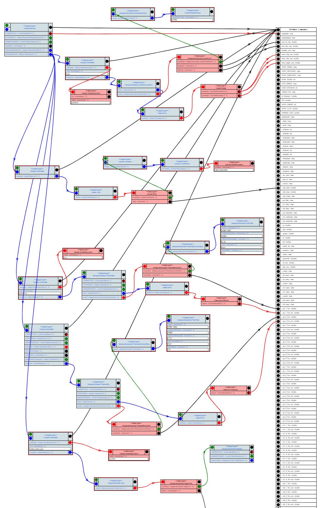

# `Standard Properties` Case

Client authors want to find scientifically relevant source properties easily.
These include
- source type
- spectral class
- mass
- physical size
- angular size
- redshift
- qualifier 
- shape
- generic measure

(Source DM WG + MANGO)

 ## implementation using VODML-Mapper: 4xmm_detections.xml
See http://dsa012.pha.jhu.edu:8081/VODML-Mapper/
Right-click on canvas, choose "Browse Other Mappings".
On dialog click "submit". 
Find mapping named "MAPPING usecases standard properties - 4xmm_detections" and click green download button.

The mapping shown is similar to this image:

</img>
Note that many of the elements have been collapsed, which leaves only those roles engaged in some mapping in the image.

NOTE only did a few of the fluxes etc. More can come later
