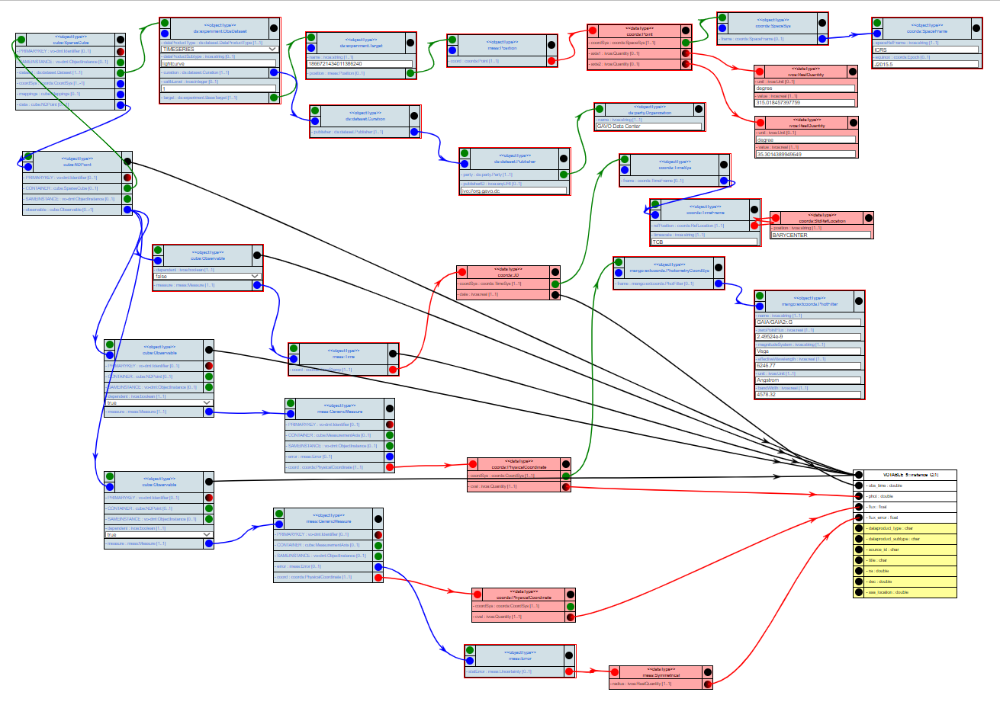
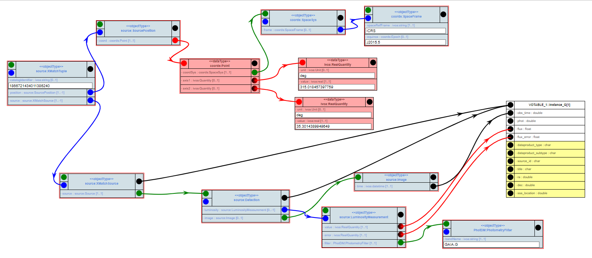

# Time Series Data Sample

## Simple case: `ts.vot` 

Simple time series (time vs mag + flux) proposed by Markus.

## Complex case: `gaia_multiband.xml`

- Gaia time series (ESAC) containing 3 light curves (G BR, RP) merged in one table. 
- The challenge is to restore all individual light curves.
- This dataset has been initially used by the TDIG as a use-case related to the CSP [roadmap](https://wiki.ivoa.net/twiki/bin/view/IVOA/CSPTimeSeries)

## Complex case: `TimeSeriesZTF.xml`

- ZTF time series where measurements related to both sources on the field of view are mixed together in one table 
- See [doc](https://irsa.ipac.caltech.edu/docs/program_interface/ztf_lightcurve_api.html)

## implementations using VODML-Mapper: 
Two maps, one using Cube ala MCD, one using a proposal for a [source model in volute](http://volute.g-vo.org/svn/trunk/projects/dm/vo-dml-org/models/source-prov/)

See http://dsa012.pha.jhu.edu:8081/VODML-Mapper/
Right-click on canvas, choose "Browse Other Mappings".
On dialog click "submit". 

### ts: Cube

Find mapping named "MAPPING usecases timeseries - ts - Cube" and click green download button.

The mapping shown is similar to this image:

</img>
Note that many of the elements have been collapsed, which leaves only those roles engaged in some mapping in the image.

### ts: source_prov

Find mapping named "MAPPING usecases timeseries - ts - source_prov" and click green download button.

The mapping shown is similar to this image:

</img>
Note that many of the elements have been collapsed, which leaves only those roles engaged in some mapping in the image.

